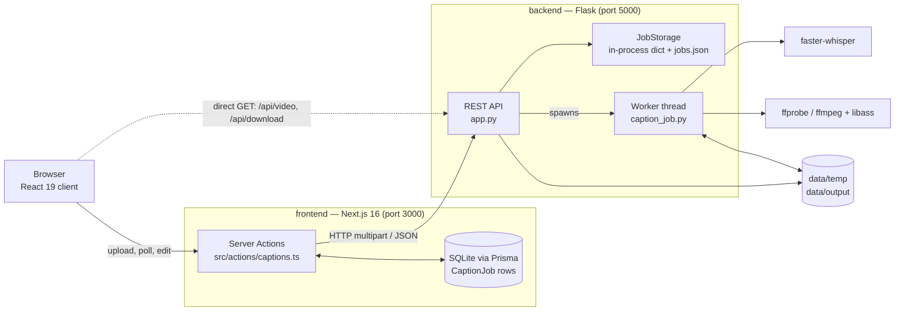
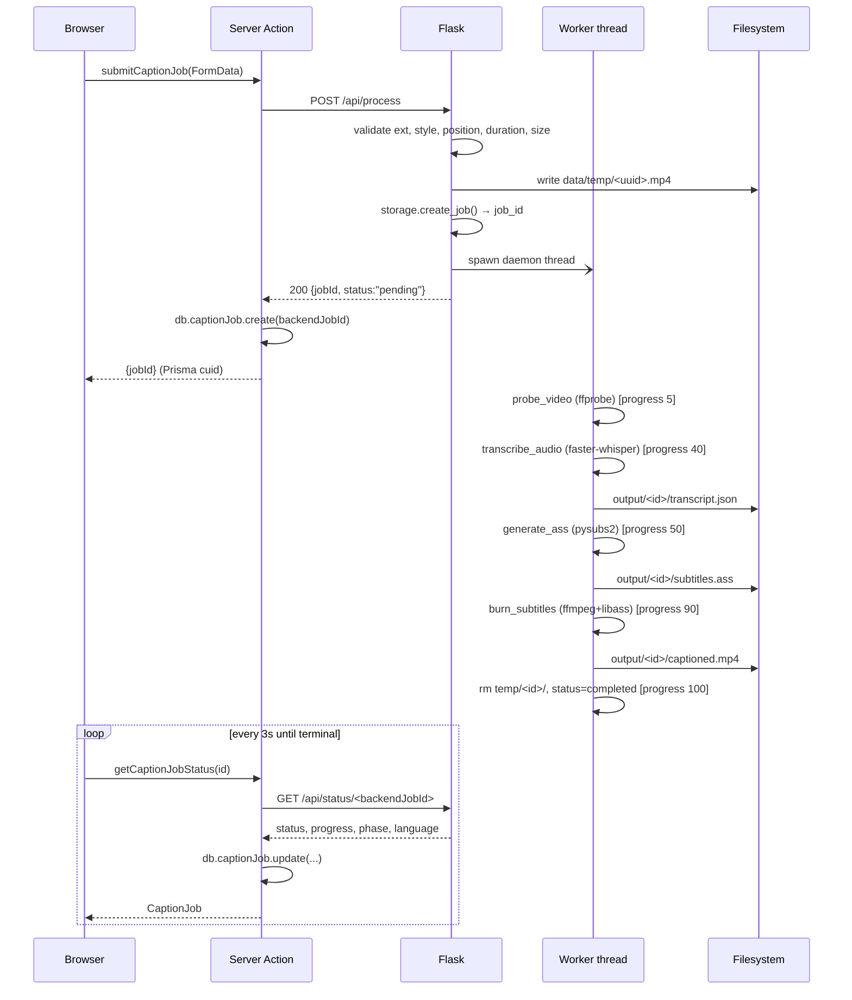
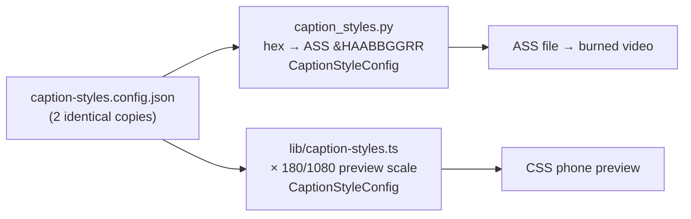
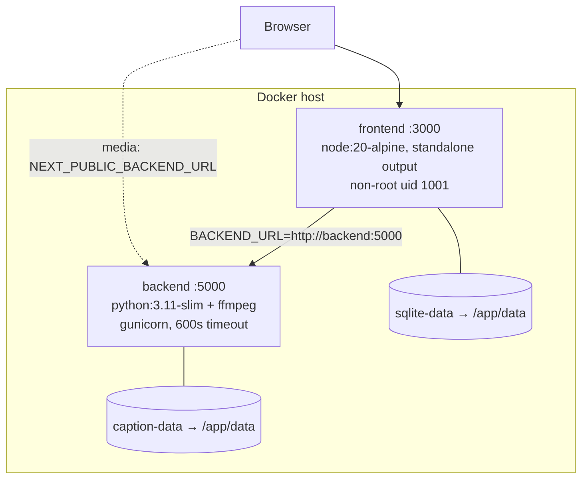

# Architecture

This document describes how **Capite** is put together: the processes,
the data that flows between them, where state lives, and the design constraints
that shape the code. It is written for contributors who need to change the system,
not just run it.

For usage instructions see [README.md](README.md); for the HTTP contract see
[docs/API.md](docs/API.md).

---

## 1. System overview

The product is a two-process application plus FFmpeg. There is no auth layer, no
queue broker, and no external service dependency — everything runs on one host.



**Division of responsibility**

| Concern | Owner | Why |
|---|---|---|
| UI, routing, style preview | frontend | React rendering, Google Fonts preview |
| User-facing job history & metadata | frontend (Prisma/SQLite) | survives backend TTL cleanup, queryable |
| Video upload, transcription, burn-in | backend | Python ML/AV toolchain lives here |
| Authoritative job progress | backend (`JobStorage`) | the worker thread is the only writer |
| Media files (`.mp4`, `.ass`, `transcript.json`) | backend filesystem | too large for a DB |

The frontend is a **proxy plus a cache**, not an independent source of truth. Every
mutation goes to Flask first; the Prisma row is updated from the backend's answer.

---

## 2. Repository layout

```
Capite/
├── backend/                       Flask API + processing pipeline
│   ├── app.py                     App factory, 8 routes, cleanup + worker threads
│   ├── caption_job.py             Pipeline: probe → transcribe → ASS → burn
│   ├── subtitles.py               ASS generation, per-word animation tags
│   ├── caption_styles.py          Loads shared JSON → CaptionStyleConfig dataclasses
│   ├── subtitle_utils.py          SCRIPT_REGISTRY, escaping, SRT/VTT/TXT export
│   ├── job_storage.py             Thread-safe job dict + jobs.json persistence
│   ├── caption-styles.config.json  ← shared config (copy #1)
│   ├── tests/                     77 pytest tests, all subprocess calls mocked
│   └── data/                      temp/ (uploads, scratch) and output/<job_id>/
│
├── frontend/                      Next.js 16 App Router
│   ├── src/app/                   / (landing), /history, /captions/[id], /api/health
│   ├── src/actions/captions.ts    "use server" — the only backend caller
│   ├── src/components/            Dropzone, style picker, phone preview, job cards
│   ├── src/components/studio/     Transcript editor, style editor, overlay player
│   ├── src/lib/caption-styles.config.json  ← shared config (copy #2)
│   ├── src/types/caption.ts       Cross-boundary TypeScript contract
│   ├── prisma/schema.prisma       CaptionJob model
│   └── DESIGN.md                  Design system: tokens, type, patterns
│
├── docs/API.md                    HTTP reference
├── docker-compose.yml             Production (built images, named volumes)
├── docker-compose.dev.yml         Development (bind mounts, FLASK_DEBUG)
└── Makefile                       setup / dev / test / lint / clean
```

---

## 3. The processing pipeline

`caption_job.process_caption_job()` is the heart of the system. It runs on a daemon
thread, is deliberately decomposed into independently mockable functions, and reports
progress through `JobStorage` at fixed milestones.



### Stage detail

| Stage | Function | Tool | Notes |
|---|---|---|---|
| Probe | `probe_video` | `ffprobe -print_format json` | Returns `(width, height, duration)`. Duration falls back from stream to container level. |
| Transcribe | `transcribe_audio` | faster-whisper, `compute_type="int8"` | `word_timestamps=True`. Model size from `WHISPER_MODEL_SIZE`. Imported lazily so tests and startup stay fast. |
| Subtitle | `generate_ass_from_transcript` → `subtitles.generate_ass` | pysubs2 | Word grouping, line wrapping, animation tags. |
| Burn | `burn_subtitles` | `ffmpeg -vf ass=... -c:v libx264 -preset veryfast -crf 18 -c:a copy` | Audio is stream-copied; video re-encoded at CRF 18. Pre-flight check rejects an ffmpeg built without libass. |

Every exception is caught at the top of `process_caption_job` and recorded as
`status="failed"` with the message in `error_message` — the worker never crashes the
process silently.

### Re-render path

`rerender_caption_job` is a shortened pipeline used by the studio: it **skips
transcription entirely**, reusing the edited transcript sent by the client, and
re-runs probe → ASS → burn. This is what makes transcript corrections and style
changes cheap (seconds, not minutes). It writes into `output/<job_id>/` directly
rather than `temp/`, and every setting falls back to the stored job value when the
caller omits it.

---

## 4. ASS subtitle generation

`subtitles.generate_ass()` is the most intricate module. Understanding its four
phases makes the rest of the styling system obvious.

**1 — Style resolution.** The style ID is looked up in `CAPTION_STYLES`, then
per-request overrides (colors, outline off) are applied via `dataclasses.replace`,
never by mutating the shared config.

**2 — Word extraction and layout.** Words are flattened out of segments, emoji are
stripped (libass cannot render them), and words are packed into groups of at most
**2 lines**. Line width is not hardcoded — `subtitle_utils.get_subtitle_layout()`
computes characters-per-line from the script's `char_width_ratio` and `font_scale`
against an 850px target:

```
effective_size = font_size × font_scale
avg_char_px    = effective_size × char_width_ratio
max_chars      = 850 / avg_char_px
```

`SCRIPT_REGISTRY` is the single source of truth for this — adding a script means
adding one frozen dataclass entry (Latin, Cyrillic, CJK, Arabic, Devanagari, Thai,
Hebrew are covered, with an RTL flag and a conservative default for everything else).

**3 — Per-word events.** For a group of *N* words the generator emits *N* dialogue
events. Each event renders the **whole line**, with the currently-spoken word
carrying the animation override tag and the rest rendered plain. Consecutive events
are chained (`event_end = next word's start`, minus 10ms) so the line appears static
while the highlight walks across it.

Two details prevent classic ASS artifacts:
- A `\pos(x,y)` tag is prepended to every event, which disables libass collision
  detection so overlapping events at word boundaries never stack vertically.
- Event ends are shortened by 10ms, clamped to a 10ms minimum duration.

**4 — Animation tags.** Seven animation types map to ASS override tags:

| Type | Tag strategy |
|---|---|
| `highlight` | `\c<color>` — plain color switch |
| `karaoke` | `\kf<centiseconds>` wipe; falls back to a plain color switch for RTL |
| `scale` | static `\fscx110\fscy110` |
| `bounce` | `\t(0,50,…120%)` then `\t(50,100,…100%)` |
| `pop` | faster 115% spring over 90ms |
| `glow` | `\blur4` + color |
| `box` | `borderstyle=3` opaque box; inactive words get alpha-255 outline so only the active word shows a pill |

Scale percentages are reduced when `font_scale < 1.0` (non-Latin scripts) to keep
the motion proportional.

---

## 5. The shared style configuration

The 27 caption styles live in a JSON file that is **byte-identical in two places**:

```
backend/caption-styles.config.json  ≡  frontend/src/lib/caption-styles.config.json
```

This duplication is intentional — it lets each Docker image build from its own
context with no shared volume or build-time copy step — and it is the reason the
phone-mockup preview and the burned-in video agree on font size, colors, outline
thickness and animation type.



Two conversions matter:

- **Color space.** JSON stores `#RRGGBB`. ASS wants `&HAABBGGRR` — *BGR order, with
  alpha where 0 = opaque*. `caption_styles.rgb_to_ass()` handles the swap and clamps
  each channel; `normalize_color_to_ass()` accepts either form so user overrides can
  arrive as hex.
- **Preview scale.** The frontend derives `previewFontSize`, `previewOutlineSize`,
  etc. by multiplying the render values by `180/1080` — the phone mockup width over
  the reference video width. Changing the mockup width means changing
  `PREVIEW_PHONE_WIDTH` only.

`caption_styles.py` also carries a `reload_caption_styles()` escape hatch: if a style
ID is unknown, it re-reads the JSON from disk once before rejecting it, so adding a
style does not strictly require a backend restart.

---

## 6. State and storage

There are **four** independent stores. Knowing which one owns what avoids most bugs.

| Store | Location | Owner | Lifetime |
|---|---|---|---|
| Job progress (authoritative) | `JobStorage` dict + `backend/data/jobs.json` | backend | until TTL cleanup |
| Job metadata for the UI | SQLite `CaptionJob` via Prisma | frontend | forever (manual delete) |
| Source upload | `backend/data/temp/<uuid>.mp4` | backend | until job delete |
| Render artifacts | `backend/data/output/<job_id>/{captioned.mp4, subtitles.ass, transcript.json}` | backend | `OUTPUT_TTL_HOURS` |

**Two ID spaces.** The frontend addresses jobs by a Prisma **cuid**; the backend uses
a **UUID4**. `CaptionJob.backendJobId` is the join, and it is `@unique`. URLs like
`/captions/<id>` carry the cuid; `/api/video/<id>` carries the UUID. Mixing them up
is the single most common mistake when adding a feature.

**`JobStorage`** guards a plain dict with a `threading.Lock`, hands out **copies** on
read (callers cannot mutate shared state), and rewrites the whole `jobs.json` inside
the lock on every mutation. `_load` tolerates a missing or corrupt file by starting
empty. `active_job_count()` backs the `MAX_CONCURRENT_JOBS` limit, which is enforced
at the top of `POST /api/process` with a 429.

**Transcript persistence is layered.** `/api/status`, `/api/transcript` and
`/api/export` all try the in-memory job first, then fall back to reading
`output/<job_id>/transcript.json`. That means transcripts survive a backend restart
even though `jobs.json` may have been truncated.

---

## 7. HTTP surface

```
GET    /api/health              → {status, version}
POST   /api/process             multipart: file, captionStyle, captionPosition,
                                durationSeconds, customFont, fontWeight,
                                weightTransition, fontStyle, textCasing,
                                primaryColor, highlightColor, outlineColor,
                                backgroundColor            → {jobId, status}
GET    /api/status/<id>         → progress, phase, language, transcript, timings
GET    /api/transcript/<id>     → {language, segments[]}
POST   /api/rerender/<id>       JSON body; ?sync=true renders inline  → {jobId,status}
GET    /api/export/<id>?format= srt | vtt | txt | ass
GET    /api/video/<id>?type=    captioned | original   (Range-enabled streaming)
GET    /api/download/<id>       attachment, 409 unless completed
DELETE /api/jobs/<id>           removes files + record
```

Validation happens entirely in `POST /api/process`, in a fixed order: concurrency
limit → file present → extension in `{.mp4, .mov, .webm}` → style ID → position
within 5–50 → client-reported duration → byte size. An unparseable `durationSeconds`
is deliberately allowed through, because ffprobe will establish the real duration
during processing.

Path safety: every media route resolves `job_id` through `storage.get_job()` first
and 404s on a miss, so an attacker-supplied ID can never reach `os.path.join`.

**Two client paths reach Flask.** Server Actions use the server-side `BACKEND_URL`
(inside Docker: `http://backend:5000`). The `<video>` element and download links use
the browser-visible `NEXT_PUBLIC_BACKEND_URL` (`http://localhost:5000`) and talk to
Flask directly, bypassing Next.js — which is why CORS is configured against
`FRONTEND_URL` and why both variables must be set correctly.

---

## 8. Frontend architecture

**Rendering strategy.** Pages are Server Components that call Server Actions
directly; `/history` and `/captions/[id]` set `dynamic = "force-dynamic"` because job
state changes constantly. All interactivity lives in `"use client"` leaf components.

**No client-side data fetching library.** `src/actions/captions.ts` is the only
module that touches the backend or Prisma; client components invoke Server Actions.
Polling is plain `setInterval` (3s during processing, 1s during re-render with a
120-attempt ceiling).

**Three screens.**

1. **Landing (`/`)** — `HeroSection` owns the entire upload state machine
   (`idle → uploading → processing → complete`) and holds all style/typography state.
   `VideoDropzone` reads the duration from an HTML5 `<video>` element before upload
   so oversized videos are rejected server-side without a full transfer.
   `CaptionPreview` renders a drag-to-position phone mockup in CSS.
2. **History (`/history`)** — Server Component listing Prisma rows as
   `CaptionJobCard`s.
3. **Studio (`/captions/[id]`)** — `CaptionResultViewer` (933 lines) is the
   orchestrator: it loads the transcript, owns all editing state, and coordinates
   three children —
   `TranscriptEditor` (word/segment editing, split/merge, find-replace),
   `StyleMotionEditor` (style, font, weight, casing, colors, position),
   `VideoOverlayPlayer` (playback + an HTML caption overlay for live preview).

**Live preview vs. burned output.** The studio toggles between streaming
`?type=original` with HTML captions drawn on top (instant feedback, no render) and
`?type=captioned` showing the real burned video. Re-render flips back to the burned
video and bumps `videoVersion` to bust the browser cache. "Download Video"
transparently triggers a re-render first when there are unsaved edits.

**Export is dual-implemented on purpose.** `lib/subtitle-export.ts` mirrors
`subtitle_utils.py` so SRT/VTT/TXT export reflects *unsaved* client-side transcript
edits instantly, with no round trip. The backend implementation still serves
`/api/export` (and is the only source for `.ass`).

**Design system.** All colour, type, radius and elevation tokens live in
`src/app/globals.css` and are documented in [frontend/DESIGN.md](frontend/DESIGN.md).
Two things are worth knowing before editing styles: Tailwind's default `gray-*`
scale is **remapped** onto a warm "oat" neutral ramp in `@theme`, so `gray-*`
utilities render warm rather than blue-grey; and the font variables are declared
on `<html>`, not `<body>`, because an undefined custom property inside a
`font-family` list invalidates the whole declaration. The `.animate-caption-*`
and `.caption-word-active-*` rules at the bottom of that file are **not** part of
the design system — they mirror the ASS animation types the backend emits and
must stay in sync with `caption-styles.config.json`.

**Type contract.** `src/types/caption.ts` is the hand-maintained mirror of the
backend's JSON shapes — `CaptionJob`, `BackendStatusResponse`, `TranscriptData`,
`RerenderJobRequest`. It is not generated, so it must be updated by hand when a
backend field changes.

---

## 9. Deployment topology



The frontend `depends_on` the backend's healthcheck, so Next.js never starts against
a dead API. `docker-entrypoint.sh` runs `prisma db push` before `node server.js` to
create the SQLite schema on a fresh volume. The dev compose file swaps in bind
mounts, `FLASK_DEBUG=true`, and Flask's dev server instead of gunicorn.

`docker-compose.dev.yml` mounts only `./frontend/src` and `./frontend/public`, so
changes to `package.json`, `next.config.ts` or the Prisma schema require a rebuild.

### Configuration

| Variable | Default | Read by |
|---|---|---|
| `MAX_FILE_SIZE_MB` | 500 | backend — also sets Flask `MAX_CONTENT_LENGTH` |
| `MAX_DURATION_MINUTES` | 30 | backend |
| `MAX_CONCURRENT_JOBS` | 2 | backend |
| `WHISPER_MODEL_SIZE` | base | backend (`tiny`…`large-v3`) |
| `OUTPUT_TTL_HOURS` | 24 | backend cleanup thread |
| `FRONTEND_URL` | http://localhost:3000 | backend CORS origin |
| `BACKEND_URL` | http://localhost:5000 | frontend, server-side |
| `NEXT_PUBLIC_BACKEND_URL` | http://localhost:5000 | frontend, browser-side |
| `DATABASE_URL` | file:./data/captions.db | Prisma |

Next.js `serverActions.bodySizeLimit` is set to `500mb` to match
`MAX_FILE_SIZE_MB`. **These two must be changed together** or uploads will fail at
whichever limit is lower.

---

## 10. Background threads

The backend runs three kinds of daemon thread, all started from the app factory or a
request handler:

| Thread | Started by | Job |
|---|---|---|
| Worker | `POST /api/process` | one full pipeline run per job |
| Re-render | `POST /api/rerender` (async mode) | shortened pipeline |
| Cleanup | `create_app()` | every hour: delete `output/<id>` older than TTL and drop the job record |

All three are `daemon=True` and wrap their body in `app.app_context()`. In `testing`
mode no threads are started at all, and re-render runs synchronously — which is why
the 77 backend tests execute in ~0.2s with every `subprocess` call mocked.

---

## 11. Testing

```
backend/tests/
  test_app.py                 route validation, status codes, error paths
  test_caption_job.py         pipeline orchestration with probe/transcribe/burn mocked
  test_subtitles.py           ASS output structure and animation tags
  test_subtitle_utils.py      script registry, escaping, layout math
  test_caption_styles.py      color conversion, config loading
  test_job_storage.py         concurrency, persistence, lifecycle
  test_transcript_export.py   SRT/VTT/TXT/ASS export routes
```

`conftest.py` builds the app through `create_app(testing=True)`, which swaps in a
temp data dir and a non-persisting `JobStorage`. No test touches ffmpeg, whisper, or
the network. There is currently no frontend test suite; `npm run lint` and
`tsc --noEmit` are the only frontend gates.

**Verified state at time of writing:** 77/77 backend tests pass; `tsc --noEmit` is
clean; `npm run lint` reports one `prefer-const` error in
`src/components/studio/video-overlay-player.tsx:240`.

---

## 12. Known gaps and constraints

These are real, currently-present issues. They are recorded here rather than hidden
so that anyone extending the system knows the boundaries.

### Blocking for multi-worker production

1. **`JobStorage` is per-process, but the production `CMD` runs `gunicorn --workers 2`.**
   Each worker holds its own dict and rewrites the same `jobs.json`. A job created in
   worker A is invisible to worker B, so status polls intermittently 404 and the last
   writer clobbers the other's file. The architecture is single-process by design —
   production should run `--workers 1`, or job state must move to a shared store
   (SQLite/Redis) before scaling out.

2. **Style fonts are not installed in the backend image.** `backend/Dockerfile`
   installs only `fonts-liberation`, but the styles reference 13 display faces
   (Montserrat, Bebas Neue, Cinzel, Orbitron, Permanent Marker, …) plus
   `IBM Plex Sans` as the non-Latin fallback, and `SCRIPT_REGISTRY` points at Noto
   CJK and IBM Plex script files under `/usr/share/fonts/`. libass silently
   substitutes, so the burned video does not match the preview — which defeats the
   stated purpose of the shared config. Add the font packages (or `COPY` the TTFs) to
   the image.

### Correctness and hygiene

3. **Uploaded source videos are never reclaimed.** `process_caption_job` removes
   `data/temp/<job_id>/` (the ASS scratch dir) but not `data/temp/<uuid>.mp4`, and
   `_cleanup_old_outputs` only walks `data/output/`. The source file is kept
   deliberately — re-render needs it — but nothing ever deletes it after TTL, so
   `data/temp/` grows without bound. (There are already 8 orphans in the working
   tree.) TTL cleanup should sweep the matching source file too.

4. **TTL cleanup desynchronises the two stores.** It deletes the backend job record
   while the Prisma row survives, leaving history entries whose video 404s. Either
   cascade the delete or render an "expired" state in the UI.

5. **`weightTransition` is dropped on re-render.** The studio has no control for it,
   `handleRerender` omits it from the payload, and `rerenderCaptionJob` then writes
   `payload.weightTransition || null` into Prisma — clearing a value the user chose
   at upload time. The backend correctly falls back to the stored value, so the two
   stores disagree afterwards.

6. **The studio's Animation Type picker does not affect the render.** `animationType`
   is not a field on `RerenderJobRequest` and the backend derives it from the style
   config (only `backgroundColor` can force it to `box`). Today the control changes
   the HTML live preview only. Either plumb it through to `generate_ass` or label it
   as preview-only.

7. **`jobs.json` is written non-atomically** on every mutation, now including full
   transcripts. A crash mid-write truncates it, and `_load` silently swallows the
   `JSONDecodeError` and starts empty — losing every job record. Write to a temp file
   and `os.replace`.

8. **A stuck job permanently consumes a concurrency slot.** `active_job_count()`
   counts `pending`/`processing`, and nothing ever times a job out. Two wedged jobs
   with the default `MAX_CONCURRENT_JOBS=2` make the service reject all uploads until
   restart.

9. **Uploads are fully buffered in memory.** `POST /api/process` calls `file.read()`
   before writing to disk, so a 500MB upload is a 500MB resident allocation per
   concurrent request. Stream to disk in chunks instead.

### Tooling and documentation drift

10. **`make lint` cannot run.** The target invokes `flake8`, which is not in
    `requirements.txt`.

11. **`make test` ignores the virtualenv.** Unlike `dev-backend`, the `test` target
     calls bare `python -m pytest`, which fails on a clean machine with
     `ModuleNotFoundError: flask_cors`. Use `.venv/bin/python`.

12. **`package-lock.json` is gitignored at the repo root** (`.gitignore:42`, no
     leading slash), so the pattern also matches `frontend/package-lock.json`. That
     file is only in the repo because it was force-added — and
     `frontend/Dockerfile` does `COPY package.json package-lock.json ./` followed by
     `npm ci`, so if it is ever dropped the image stops building. Anchor the pattern
     to `/package-lock.json`.

13. **The style count still disagrees between the README and the app.** There are
     **27** styles in the shared config. The frontend now says 27 everywhere
     (metadata, hero badge, hero stats, how-it-works), but `README.md` still
     advertises "6 Trending Caption Styles" and lists only six names.

14. **`docs/API.md` is stale.** It omits `/api/transcript`, `/api/rerender`,
     `/api/export` and `/api/video` entirely, lists only 6 style IDs, and documents
     none of the typography or color form fields.

15. **Default port disagreement.** `app.py`'s `__main__` block defaults to `5001`
     while the README, `.env.example`, `docs/API.md` and both compose files use
     `5000`.

### Accepted design constraints

- **No authentication or per-user isolation.** Any visitor can read or delete any
  job. This is intentional for a self-hosted, single-user tool — do not expose the
  backend port to the internet.
- **Transcription is CPU-bound and serialised** by `MAX_CONCURRENT_JOBS`. There is no
  GPU path and no distributed queue.
- **Vertical-first layout.** Line-width math is calibrated against a 1080×1920
  reference; other aspect ratios scale via `dimension_scale = max(height/1920, 0.35)`
  but were not the design target.
- **Config duplication is deliberate.** Two identical JSON files keep the Docker
  build contexts independent; the cost is that they must be edited together. Both are
  currently in sync.

---

## 13. Extension points

| Goal | Touch |
|---|---|
| Add a caption style | Both `caption-styles.config.json` copies, plus the `CaptionStyle` union and `CAPTION_STYLES` array in the frontend |
| Add an animation type | `subtitles.py` tag branch, `AnimationType` union, `ANIMATION_TYPES` in `style-motion-editor.tsx` |
| Support a new script/language | One `ScriptConfig` entry in `SCRIPT_REGISTRY` — plus the matching font in the backend image |
| Add an export format | `subtitle_utils.py` writer + `/api/export` branch, and mirror it in `lib/subtitle-export.ts` |
| Add a job field | Prisma schema → migration → `JobStorage.create_job` → `types/caption.ts` → `mapPrismaJobToType` |
| Swap the ASR engine | `caption_job.transcribe_audio` only — it must keep returning `{language, segments[{start,end,text,words[]}]}` |
