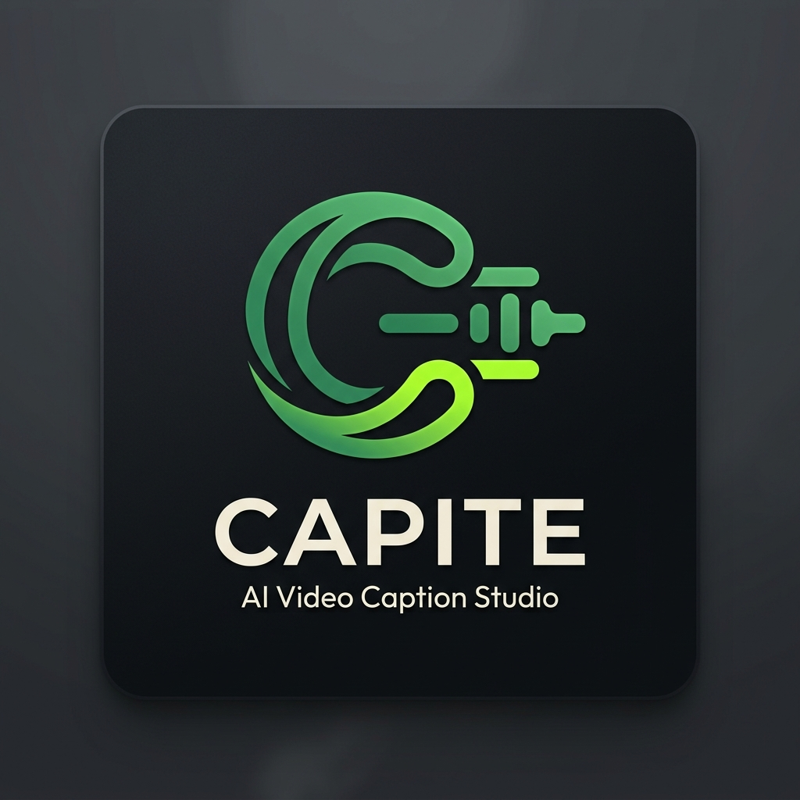
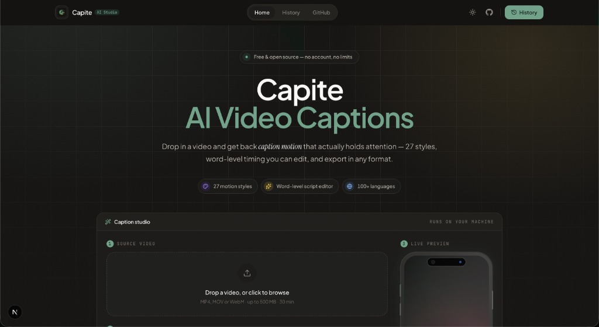
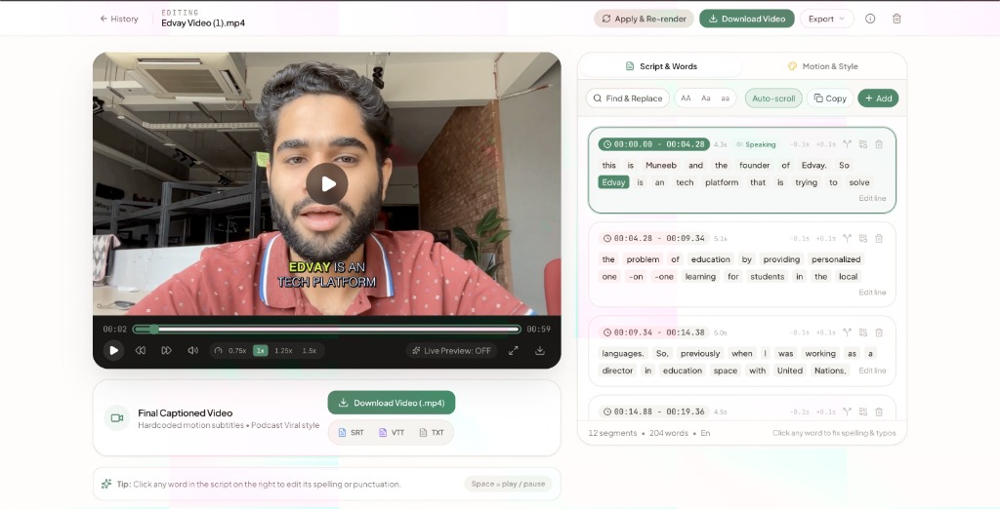
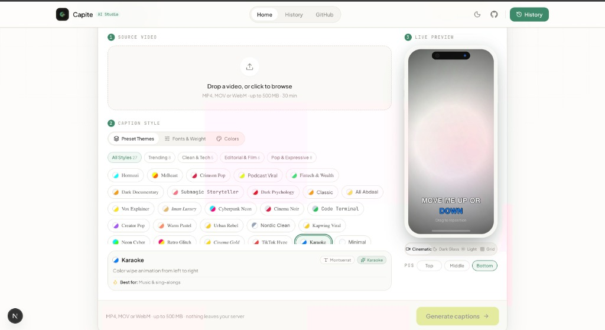
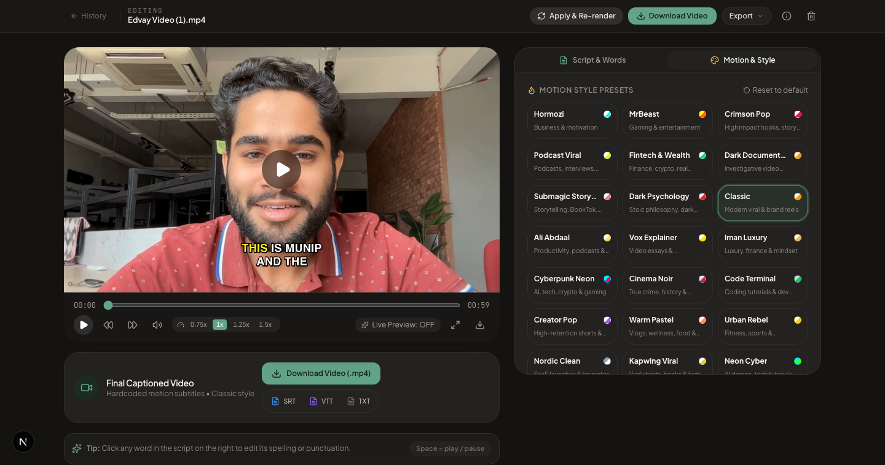
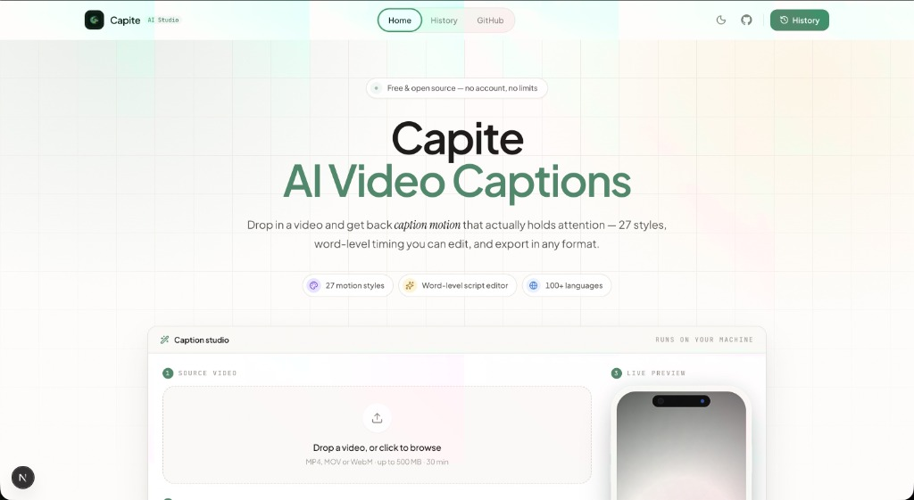
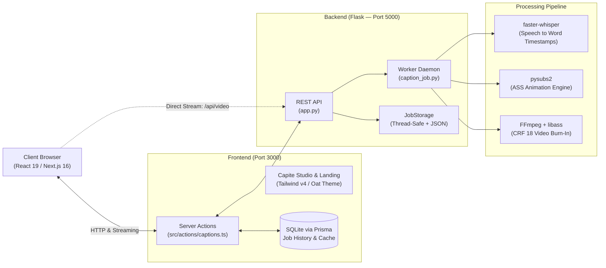

<p align="center">
  <a href="https://github.com/muneebkhan08/Capite">
    
  </a>
</p>

<h1 align="center">Capite — Open-Source AI Video Caption Generator & Auto Subtitle Studio</h1>

<p align="center">
  <strong>The Free, Privacy-First Alternative to Submagic, CapCut, and OpusClip for TikTok, Instagram Reels & YouTube Shorts</strong>
</p>

<p align="center">
  Generate viral, word-animated captions for your videos in seconds with local AI.<br/>
  <strong>27 trending motion styles</strong> &bull; <strong>Interactive word-level transcript editor</strong> &bull; <strong>Instant in-place re-rendering</strong> &bull; <strong>Multi-format export (MP4, SRT, VTT, TXT, ASS)</strong> &bull; <strong>100+ languages</strong> &bull; <strong>100% self-hosted & private</strong> &bull; <strong>Zero subscriptions, free forever</strong>.
</p>

<p align="center">
  <a href="https://github.com/muneebkhan08/Capite/blob/main/LICENSE"></a>
  <a href="https://github.com/muneebkhan08/Capite"></a>
  <a href="https://github.com/muneebkhan08/Capite"></a>
  <a href="https://github.com/muneebkhan08/Capite"></a>
  <a href="https://github.com/muneebkhan08/Capite"></a>
  <a href="https://github.com/muneebkhan08/Capite"></a>
  <a href="https://github.com/muneebkhan08/Capite"></a>
  <a href="https://github.com/muneebkhan08/Capite"></a>
  <a href="https://www.linkedin.com/in/muhammadmuneebkhan8304/"></a>
  <a href="mailto:muneebkhan08304@gmail.com"></a>
</p>

<p align="center">
  
</p>

---

## 📑 Table of Contents

1. [About Capite](#-about-capite)
2. [Why Capite? (Competitor Comparison Matrix)](#-why-capite-competitor-comparison-matrix)
3. [Interface & Studio Showcase](#-interface--studio-showcase)
4. [Key Features & Capabilities](#-key-features--capabilities)
5. [27 Built-In Viral Caption Styles](#-27-built-in-viral-caption-styles)
6. [Quick Start Guide](#-quick-start-guide)
   - [Docker Compose Setup (Recommended)](#1-docker-compose-recommended)
   - [Local Development Setup](#2-local-development-setup)
7. [Complete Usage Guide](#-complete-usage-guide)
8. [Subtitle & Video Export Formats (.SRT, .VTT, .TXT, .ASS)](#-subtitle--video-export)
9. [System Architecture](#-system-architecture)
10. [REST API Reference](#-rest-api-reference)
11. [Configuration & Environment Variables](#-configuration--environment-variables)
12. [Frequently Asked Questions (FAQ)](#-frequently-asked-questions-faq)
13. [Supported Use Cases & Search Keywords](#-supported-use-cases--search-keywords)
14. [Documentation Index](#-documentation-index)
15. [Creator & Contact](#-creator--contact)
16. [License](#-license)

---

## ⚡ About Capite

**Capite** is a modern, high-performance, **open-source AI video caption generator** and animated subtitle studio built for content creators, video editors, podcasters, and developers. Built from the ground up to bring viral, word-animated typography to your short-form videos (TikTok, Instagram Reels, YouTube Shorts) and long-form video projects without costly SaaS subscriptions or cloud privacy risks.

### Why Capite is Different
- **100% Free & Open Source**: Full source code access under the permissive MIT License.
- **Zero Cloud Subscriptions**: No \$20-\$50/month fees, no credits system, no paywalls.
- **Zero Watermarks**: Clean, broadcast-quality video exports with no forced branding.
- **Zero Video Caps**: Process unlimited videos with no duration or file size restrictions.
- **100% Private & Self-Hosted**: All speech-to-text transcription and video rendering occurs locally on your hardware. Your footage never touches third-party servers.

### The Production Stack
- **AI Speech Recognition**: Powered by `faster-whisper` (CTranslate2-optimized Whisper models) providing blazing-fast, offline speech-to-text with millisecond-accurate word timestamps.
- **Motion Typography Engine**: `pysubs2` + `FFmpeg libass` rendering broadcast-grade ASS subtitle animations directly into high-definition video at visually lossless quality (CRF 18).
- **Web Studio**: Next.js 16 (React 19) App Router, Tailwind CSS v4, and a warm paper-inspired Oat & Clay design system with responsive dark and light modes.

---

## ⚖️ Why Capite? Competitor Comparison Matrix

Looking for the **best open-source caption generator** or a **free alternative to Submagic, CapCut, OpusClip, or AutoCut**? Here is how Capite compares directly against commercial closed-source platforms:

| Feature / Capability | **Capite (Open-Source)** | **Submagic** | **CapCut** | **OpusClip** | **Veed.io / AutoCut** |
|:---|:---:|:---:|:---:|:---:|:---:|
| **Pricing / Plan** | 🟢 **100% Free Forever** | 🔴 \$20 – \$50 / month | 🟡 Freemium (\$9.99+/mo) | 🔴 \$19 – \$49 / month | 🔴 \$18 – \$38 / month |
| **Open Source (MIT)** | 🟢 **Yes (Self-Hosted)** | 🔴 No (Proprietary) | 🔴 No (Proprietary) | 🔴 No (Proprietary) | 🔴 No (Proprietary) |
| **Data Privacy & Security** | 🟢 **100% Local (Zero Cloud)** | 🔴 Video Upload Required | 🔴 Video Upload Required | 🔴 Video Upload Required | 🔴 Video Upload Required |
| **Watermarks** | 🟢 **Zero Watermarks** | 🔴 Watermarked on Free Plan | 🟡 Watermark on templates | 🔴 Watermarked on Free Plan | 🔴 Watermarked on Free Plan |
| **Monthly Video Limits** | 🟢 **Unlimited (No Caps)** | 🔴 20–60 mins/month cap | 🟡 Cloud storage caps | 🔴 Credit/minute quotas | 🔴 10–30 mins/month |
| **Speech-to-Text Engine** | 🟢 **faster-whisper (Offline AI)**| 🟡 Cloud Whisper API | 🟡 Cloud Speech API | 🟡 Cloud Whisper API | 🟡 Cloud Speech API |
| **Word-Level Timestamp Accuracy** | 🟢 **Millisecond Precision** | 🟢 Supported | 🟡 Segment / sentence level | 🟡 Clip level | 🟢 Supported |
| **Viral Motion Styles** | 🟢 **27 Built-In Presets** | 🟡 Limited in Starter | 🟡 Preset templates | 🟡 Fixed video templates | 🟡 Limited in basic |
| **Interactive Word Transcript Editor** | 🟢 **Click-to-Seek Word Chips** | 🟢 Web Editor | 🟡 Timeline track | 🔴 Repurposing only | 🟢 Basic text box |
| **Font & Physics Customization** | 🟢 **Weights, Shaders, Easing** | 🔴 Fixed style packs | 🟡 Basic font selection | 🔴 Minimal customization | 🟡 Basic presets |
| **Subtitle Export (.SRT, .VTT, .ASS)** | 🟢 **Free (.SRT, .VTT, .TXT, .ASS)**| 🔴 Paid addon / locked | 🟡 Limited to MP4/TXT | 🟡 Paid tiers | 🔴 Paid tiers only |
| **Offline / Air-Gapped Operation** | 🟢 **Yes (Docker & Local)** | 🔴 Requires Internet | 🔴 Requires Cloud Sync | 🔴 Requires Internet | 🔴 Requires Internet |

---

## 📸 Interface & Studio Showcase

### 1. Interactive Studio & Word-Level Transcript Editor
Fix transcription typos, adjust word timing, customize styles, and re-render in seconds — all in one unified workspace.

<p align="center">
  
</p>

- **Click-to-Seek Word Chips**: Every word is rendered as an interactive chip. Click any word to jump playback directly to that millisecond.
- **Direct Inline Editing**: Fix transcription typos, technical terms, or names immediately in the script cards.
- **Timing Nudge Controls**: Adjust sentence segment boundaries with `-0.1s` / `+0.1s` micro-nudges.
- **Batch Text Tools**: Built-in Find & Replace, text casing converters (`AA` UPPERCASE, `Aa` Title Case, `aa` lowercase), auto-scroll follower, and one-click copy.
- **Synchronized Video Player**: Variable playback speed (`0.75x`, `1x`, `1.25x`, `1.5x`), frame seeking, and instant preview.

---

### 2. 27 Caption Styles & Live Mobile Mockup Preview
Browse trending, editorial, pop, and tech styles with a responsive live phone preview before processing.

<p align="center">
  
</p>

- **Categorized Presets**: Filter through *Trending (8)*, *Clean & Tech (5)*, *Editorial & Film (6)*, and *Pop & Expressive (8)*.
- **Style Details**: Real-time descriptions of animation types, active fonts, and recommended content formats (e.g., Podcasts, TikTok, Reels, Financial, Documentaries).
- **Interactive Positioning**: Drag subtitles up or down on the phone screen or use quick presets (`Top`, `Middle`, `Bottom`).
- **Dynamic Backgrounds**: Test subtitle visibility against multiple mock backdrops (`Cinematic`, `Dark Glass`, `Light`, `Grid`).

---

### 3. Motion & Style Customizer & Light/Dark Themes
Fine-tune fonts, animation physics, weight transitions, and color shaders.

| Studio Style & Motion Panel | Paper Oat Light Mode |
|:---:|:---:|
|  |  |
| *Customize fonts, font weights, weight transitions, casing, and custom color shaders.* | *Warm, paper-inspired oat light palette with accessible WCAG AA contrast.* |

---

## ✨ Key Features & Capabilities

- **🔥 27 Viral Caption Styles**: Inspired by top content creators across TikTok, YouTube Shorts, and Instagram Reels (Hormozi, MrBeast, Crimson Pop, Podcast Viral, Submagic Storyteller, Ali Abdaal, Vox Explainer, and more).
- **⚡ 7 Motion Typography Engines**: Dynamic Word Highlight, Karaoke Fill, Pop-In / Spring, Elastic Bounce, Smooth Zoom / Scale, Neon Glow, and Accent Highlight Box.
- **🎯 Word-Level Millisecond Accuracy**: Powered by OpenAI's Whisper through `faster-whisper` (CTranslate2) for instant, accurate word boundary timestamps.
- **📝 Interactive Live Studio Suite**: Word-level transcript editing, click-to-seek playback, millisecond timestamp adjustment, and keyboard shortcuts (`Space` to play/pause).
- **⚡ Instant In-Place Re-Rendering**: Updated words or picked a new motion style? Re-burn your video in seconds without re-running transcription!
- **📥 Universal Subtitle & Video Export**: Download hardcoded HD MP4, SubRip (`.srt`), WebVTT (`.vtt`), plain text (`.txt`), or Advanced SubStation Alpha (`.ass`).
- **🌍 100+ Languages with Script-Aware Fonts**: Automatic language detection with script-aware font fallback (Latin, CJK, Arabic, Devanagari, Thai, Hebrew, Cyrillic).
- **🔒 100% Private, Local & Self-Hosted**: Your videos, audio, and transcripts never leave your computer. No external API keys needed.
- **🎨 Modern Oat & Clay Design System**: Crafted with Next.js 16, React 19, and Tailwind CSS v4 for an elegant, distraction-free editing experience.

---

## 🎨 27 Built-In Viral Caption Styles

| Preset ID | Name | Category | Animation Engine | Primary Color | Highlight Color | Best For |
|---|---|---|---|---|---|---|
| `hormozi` | Hormozi | Trending | Word Highlight | White `#FFFFFF` | Cyan `#00FFFF` | Business, Hooks & Motivation |
| `mrbeast` | MrBeast | Trending | Word Highlight | Yellow `#FFFF00` | Orange `#FF6600` | Gaming & High-Energy Shorts |
| `crimson-pop` | Crimson Pop | Trending | Box Pop | White `#FFFFFF` | Crimson `#DC2626` | High-Retention Viral Hooks |
| `podcast-viral` | Podcast Viral | Trending | Word Highlight | White `#FFFFFF` | Electric Lime `#A3E635` | Podcasts & Interview Clips |
| `fintech-wealth` | Fintech & Wealth | Trending | Neon Glow | Fluorescent `#E0E7FF` | Emerald `#10B981` | Finance, Crypto & Tech |
| `dark-documentary`| Dark Documentary | Trending | Smooth Scale | Pale Gray `#F1F5F9` | Crimson `#E11D48` | Crime & Mystery Documentaries |
| `submagic` | Submagic Storyteller | Trending | Elastic Bounce | Cream `#FEF9C3` | Vivid Purple `#A855F7` | Narrative Reels & Storytelling |
| `dark-psychology` | Dark Psychology | Trending | Neon Glow | Pure White `#FFFFFF` | Blood Red `#DC2626` | Philosophy & Thrillers |
| `classic` | Classic | Trending | Word Highlight | White `#FFFFFF` | Yellow `#FFFF00` | General Short-Form Subtitles |
| `ali-abdaal` | Ali Abdaal | Trending | Word Highlight | Soft Cream `#FFFBEB` | Pastel Blue `#38BDF8` | Productivity & Study Tips |
| `vox-explainer` | Vox Explainer | Editorial-Film | Word Highlight | Off-White `#F8FAFC` | Bright Yellow `#FBBF24` | Educational Video Essays |
| `iman-luxury` | Iman Luxury | Editorial-Film | Smooth Scale | Off-White `#F8FAFC` | Champagne Gold `#D97706` | Luxury & Cinematic Vlogs |
| `cyberpunk-neon` | Cyberpunk Neon | Pop-Expressive | Neon Glow | Cyan `#22D3EE` | Neon Magenta `#F43F5E` | Gaming, Streams & Sci-Fi |
| `cinema-noir` | Cinema Noir | Editorial-Film | Fade / Scale | Silver `#E2E8F0` | White `#FFFFFF` | Dramatic Storytelling |
| `code-terminal` | Code Terminal | Clean-Tech | Word Highlight | Terminal White `#F1F5F9` | Matrix Green `#22C55E` | Tech & Dev Tutorials |
| `creator-pop` | Creator Pop | Pop-Expressive | Pop-In | White `#FFFFFF` | Hot Pink `#EC4899` | Vlogs & Lifestyle Clips |
| `warm-pastel` | Warm Pastel | Pop-Expressive | Elastic Bounce | Lavender `#F3E8FF` | Coral Rose `#FB7185` | Wellness & Beauty Reels |
| `urban-rebel` | Urban Rebel | Pop-Expressive | Pop-In | Pale Yellow `#FEF08A` | Bright Red `#EF4444` | Streetwear & Hip Hop |
| `nordic-clean` | Nordic Clean | Clean-Tech | Word Highlight | Pure White `#FFFFFF` | Slate `#94A3B8` | Architecture & Minimal Design |
| `kapwing-viral` | Kapwing Viral | Trending | Word Highlight | White `#FFFFFF` | Vibrant Blue `#2563EB` | Fast-Paced Social Clips |
| `neon-cyber` | Neon Cyber | Pop-Expressive | Neon Glow | Pure White `#FFFFFF` | Electric Teal `#14B8A6` | Futuristic Tech Reviews |
| `retro-glitch` | Retro Glitch | Pop-Expressive | Pop-In | Light Pink `#FCE7F3` | Violet `#8B5CF6` | Nostalgia & Anime Edits |
| `cinema-gold` | Cinema Gold | Editorial-Film | Word Highlight | Off-White `#FAFAFA` | Vintage Gold `#CA8A04` | Cinematic Shorts |
| `tiktok-hype` | TikTok Hype | Trending | Elastic Bounce | White `#FFFFFF` | Bright Orange `#F97316` | Viral TikTok Reactions |
| `karaoke` | Karaoke | Trending | Karaoke Wipe | White `#FFFFFF` | Electric Blue `#3B82F6` | Sing-Alongs & Music Videos |
| `minimal` | Minimal | Clean-Tech | Word Highlight | Pure White `#FFFFFF` | Soft Yellow `#FEF08A` | Minimalist Talking-Head Clips |
| `clean-tech` | Clean Tech | Clean-Tech | Word Highlight | Pure White `#FFFFFF` | Electric Blue `#38BDF8` | SaaS & Product Walkthroughs |

---

## 🚀 Quick Start Guide

### 1. Docker Compose (Recommended)

Run Capite with Docker in under 2 minutes:

```bash
# 1. Clone repository
git clone https://github.com/muneebkhan08/Capite.git
cd Capite

# 2. Launch services
docker compose up
```

Open your browser at **[http://localhost:3000](http://localhost:3000)**.

To stop the containers:
```bash
docker compose down
```

---

### 2. Local Development Setup

#### Prerequisites
- **Python 3.11+**
- **Node.js 20+** & npm
- **FFmpeg** with `libass` support (`brew install ffmpeg` on macOS, `sudo apt install ffmpeg libass-dev` on Ubuntu/Debian)

#### One-Command Setup
```bash
# 1. Clone repository
git clone https://github.com/muneebkhan08/Capite.git
cd Capite

# 2. Run automated setup (creates virtualenv & installs packages)
make setup

# 3. Start development servers (frontend on :3000, backend on :5000)
make dev
```

#### Manual Setup

**Backend (Flask):**
```bash
cd backend
python3 -m venv .venv
source .venv/bin/activate
pip install -r requirements.txt
python app.py
```

**Frontend (Next.js 16):**
```bash
cd frontend
npm install
DATABASE_URL="file:./data/captions.db" npx prisma generate
DATABASE_URL="file:./data/captions.db" npx prisma db push
DATABASE_URL="file:./data/captions.db" npm run dev
```

---

## 📖 Complete Usage Guide

### Step 1: Upload Your Video
- Drag and drop your `.mp4`, `.mov`, or `.webm` file into the upload dropzone (up to 500MB, up to 30 minutes duration).
- Select your preferred default caption style from the 27 presets.
- Drag the caption position slider to adjust vertical placement on the screen (5% to 50% from the bottom).
- Click **Generate Captions →**.

### Step 2: Transparent AI Processing Pipeline
- **Upload**: Video streams directly to the local backend.
- **Transcribe**: `faster-whisper` isolates spoken words and generates millisecond-accurate timestamps and language confidence.
- **Generate Subtitles**: `pysubs2` constructs an ASS subtitle script applying animations, highlight shaders, and fonts.
- **Burn-In**: FFmpeg burns the subtitle layer onto the video using `libass` at CRF 18 visually lossless quality.

### Step 3: Studio Transcript & Motion Editor
- Once completed, the Studio Editor opens automatically.
- **Seek Video**: Click any word in the transcript on the right to jump playback to that exact word.
- **Edit Script**: Click on any word to fix speech typos, replace names, or modify punctuation.
- **Customize Motion & Typography**: Switch to the **Motion & Style** tab to test new fonts, font weights, weight transitions (`light_to_bold` or `bold_to_light`), or custom colors.
- **Re-render**: Click **Apply & Re-render** to burn the new subtitles into the video in seconds without waiting for transcription again.

### Step 4: Export Your Final Captions & Video
- Click **Download Video (.mp4)** to download your final captioned video.
- Or click **.SRT**, **.VTT**, or **.TXT** to export subtitle files for Premiere Pro, DaVinci Resolve, Final Cut, or YouTube.

---

## 📦 Subtitle & Video Export

Capite supports direct export to industry-standard subtitle formats for maximum workflow flexibility:

- **Burned HD MP4 Video**: High-definition MP4 encoded with CRF 18 quality and original audio stream preserved.
- **SubRip (`.srt`)**: Compatible with Adobe Premiere Pro, DaVinci Resolve, Final Cut Pro, and YouTube Studio.
  ```srt
  1
  00:00:00,000 --> 00:00:04,280
  This is Muneeb, founder of Edvay.

  2
  00:00:04,280 --> 00:00:09,340
  Edvay is an education platform providing personalized learning.
  ```
- **WebVTT (`.vtt`)**: Modern web video text tracks for HTML5 video players.
  ```vtt
  WEBVTT

  1
  00:00:00.000 --> 00:00:04.280
  This is Muneeb, founder of Edvay.
  ```
- **Plain Text (`.txt`)**: Raw transcript text without timing tags, perfect for blog posts and show notes.
- **Advanced SubStation Alpha (`.ass`)**: Complete subtitle styling script with word-by-word animation tags.

---

## 🏗️ System Architecture



For complete architectural details, see [ARCHITECTURE.md](ARCHITECTURE.md).

---

## 📡 REST API Reference

Full REST API documentation is available in [docs/API.md](docs/API.md).

| Method | Endpoint | Description |
|---|---|---|
| `GET` | `/api/health` | Service health status check |
| `POST` | `/api/process` | Upload video file and queue transcription & caption job |
| `GET` | `/api/status/{jobId}` | Poll progress percentage, phases, language, and transcript |
| `POST` | `/api/rerender/{jobId}` | Fast re-render with updated transcript, styles, or colors |
| `GET` | `/api/export/{jobId}` | Export subtitles as `.srt`, `.vtt`, `.txt`, or `.ass` |
| `GET` | `/api/video/{jobId}` | Stream original or captioned video with seeking support |
| `GET` | `/api/download/{jobId}` | Download finalized captioned video file |
| `DELETE` | `/api/jobs/{jobId}` | Delete job and cleanup media scratch files |

---

## ⚙️ Configuration & Environment Variables

Copy `.env.example` to `.env` to configure your instance:

| Variable | Default | Description |
|---|---|---|
| `WHISPER_MODEL_SIZE` | `base` | Whisper model: `tiny`, `base`, `small`, `medium`, `large-v3` |
| `MAX_FILE_SIZE_MB` | `500` | Maximum upload size in MB |
| `MAX_DURATION_MINUTES` | `30` | Maximum video duration allowed |
| `MAX_CONCURRENT_JOBS` | `2` | Simultaneous encoding worker threads |
| `OUTPUT_TTL_HOURS` | `24` | Auto-cleanup time for temporary output files |
| `FRONTEND_URL` | `http://localhost:3000` | Allowed CORS origin |
| `BACKEND_URL` | `http://localhost:5000` | Backend API URL for Next.js server actions |
| `DATABASE_URL` | `file:./data/captions.db` | SQLite database connection string |

---

## ❓ Frequently Asked Questions (FAQ)

### What is Capite?
**Capite** is a free, open-source AI video caption generator and auto subtitle editor that automatically transcribes speech and burns animated, viral typography into videos for TikTok, Instagram Reels, YouTube Shorts, and podcasts.

### What makes Capite the best open-source AI video caption generator?
Capite combines the accuracy of OpenAI's Whisper (via `faster-whisper`) with a broadcast-grade motion typography engine (`pysubs2` + `FFmpeg libass`) and a modern Next.js 16 web studio. Unlike commercial tools like Submagic, CapCut, or OpusClip, Capite is 100% free, open-source (MIT licensed), runs locally on your machine, has no video duration limits, and produces zero watermarks.

### How does Capite compare to Submagic, CapCut, and OpusClip?
Submagic and OpusClip are paid cloud-based subscription services that charge between \$20 to \$50 per month, limit your monthly video minutes, and require uploading your video files to third-party servers. CapCut offers auto-captions but limits typography customization and requires cloud connectivity. Capite runs entirely on your local machine or Docker container, respects your privacy, gives you 27 trending viral motion styles, provides full word-level editing, and is completely free forever.

### Can I generate subtitles for TikTok, Instagram Reels, and YouTube Shorts?
Yes! Capite is specifically optimized for vertical short-form video formats (9:16) as well as horizontal long-form videos (16:9). You can customize caption placement, font size, animation styles, and colors to match popular TikTok, Instagram Reel, and YouTube Short trends (such as Hormozi, MrBeast, and Submagic styles).

### Is Capite completely free without watermarks or export limits?
Yes. Capite is 100% free and open-source under the MIT License. There are no watermarks, no minute limits, no export caps, and no paywalls. You can process as many videos as your local hardware allows.

### Does Capite work offline without an internet connection or API keys?
Yes. Capite uses `faster-whisper`, an optimized local CTranslate2 implementation of OpenAI's Whisper model. Once the Docker container or local environment is initialized and the Whisper model weights are downloaded, transcription and rendering run entirely offline without needing an internet connection or an OpenAI API key.

### What subtitle formats can I export from Capite?
Capite supports exporting subtitles in multiple industry-standard formats:
- **Hardcoded MP4 Video**: Subtitles burned directly into the video with CRF 18 visually lossless quality.
- **SubRip (.SRT)**: Universal subtitle format compatible with Adobe Premiere Pro, DaVinci Resolve, Final Cut Pro, and YouTube.
- **WebVTT (.VTT)**: Web video text track format for HTML5 video players and websites.
- **Plain Text (.TXT)**: Clean transcript without timestamp markers.
- **Advanced SubStation Alpha (.ASS)**: Complete styling script containing word-by-word animation and positioning metadata.

### What languages does Capite support for automatic speech recognition?
Capite supports over 100 languages via Whisper AI, including English, Spanish, Portuguese, French, German, Italian, Hindi, Arabic, Japanese, Chinese, Korean, Russian, Dutch, Turkish, and many more. It includes script-aware font fallback to properly render non-Latin scripts (CJK, Arabic, Devanagari, Hebrew, Cyrillic).

---

## 🔍 Supported Use Cases & Search Keywords

Capite satisfies search intent across popular creator, video editing, and AI transcription queries:

- **AI Video Caption Generator**: Automated speech recognition and animated typography.
- **Open-Source Caption Generator**: 100% self-hosted and free alternative to cloud SaaS.
- **Free Submagic Alternative**: Word-level bounce, karaoke, and highlight subtitle animations.
- **CapCut Auto Captions Alternative**: Local, watermark-free subtitle generator for Mac, Windows, and Linux.
- **OpusClip & AutoCut Alternative**: High-retention short-form video captions.
- **Alex Hormozi Style Captions**: High-contrast yellow/cyan word highlight animations.
- **MrBeast Style Subtitles**: Pop and bounce gaming animations with custom colors.
- **Podcast Video Subtitles**: Multi-speaker transcription with timing adjustments.
- **TikTok & Instagram Reels Subtitles**: Vertical 9:16 video formatting with adjustable safe zones.
- **Whisper Subtitle Generator**: Millisecond-accurate speech-to-text with local CTranslate2 acceleration.

---

## 📚 Documentation Index

- [ARCHITECTURE.md](ARCHITECTURE.md) — System processes, thread lifecycle, concurrency model, and data flow.
- [docs/API.md](docs/API.md) — Full REST API specification with parameter tables, request bodies, and curl examples.
- [CONTRIBUTING.md](CONTRIBUTING.md) — Development setup, branch guidelines, and testing workflow.
- [frontend/DESIGN.md](frontend/DESIGN.md) — Oat & Clay design tokens, contrast ratios, and typography rules.

---

## 👨‍💻 Creator & Contact

**Muhammad Muneeb Khan**

- **LinkedIn**: [https://www.linkedin.com/in/muhammadmuneebkhan8304/](https://www.linkedin.com/in/muhammadmuneebkhan8304/)
- **Email**: [muneebkhan08304@gmail.com](mailto:muneebkhan08304@gmail.com)
- **GitHub**: [@muneebkhan08](https://github.com/muneebkhan08)
- **Project Repo**: [https://github.com/muneebkhan08/Capite](https://github.com/muneebkhan08/Capite)

---

## 📄 License

Capite is open-source software licensed under the [MIT License](LICENSE).
